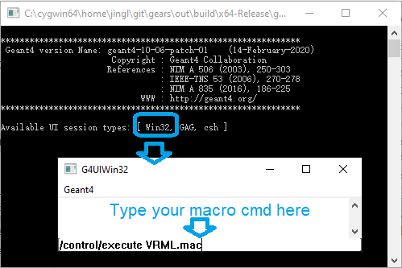

[](https://github.com/jintonic/gears)
[](..)
[](#session-mode)

## User interface (UI)
[](https://youtube.com/playlist?list=PLw3G-vTgPrdABdR2C4u77jK4YYF5GAoxe)

[GEARS][] relies on [G4UIExecutive][] to select a user interface (UI). Without any specific setup, [GEARS][] will try to run a graphic user interface (GUI) based on [Qt][] or Windows GUI. If your [Geant4][] is not compiled with GUI support, [GEARS][] will try to use a command-line interface ([CLI][]). In Windows, go to a folder where you'd like to run [GEARS][] in your file browser. Highlight the address bar, type `gears.exe`:


This will bring up the following GUI, which is simply a window to accept your macro commands:



In macOS or Linux, please run the following command to check if your [Geant4][] is compiled with [Qt][]:

```sh
$ geant4-config --help | grep qt
```

If the output is `qt[yes]`, then you should be able to use the [Qt][] based GUI. If you can't, please check if you set the environment variable `G4UI_USE_TCSH` somewhere:

```sh
$ env |grep G4UI
```

If yes, run `export G4UI_USE_QT=1` to overwrite the `G4UI_USE_TCSH` setting, and run `gears` again. It is optional to delete the latter, because if both variables are set, the latter will be ignored.

Now, if you want to go back to the command-line UI, you need to `unset G4UI_USE_QT` and keep the `G4UI_USE_TCSH` setting unchanged. `export G4UI_USE_QT=0` or `export G4UI_USE_QT=false` does not do what you intend to do. In fact, you can set `G4UI_USE_QT` to any value. It will take effect as long as it is not empty. The only way to completely get rid of it is to `unset` it.

If none of the environment variables is set, you can use `~/.g4session` to select your UI:

```sh
qt # the first line is for all Geant4 applications
gears tcsh # just for gears
```

## Session mode

Without any argument, `gears` will start an interactive [session][]. It accepts Geant4 [macro][] commands you type in the UI.

You can also put a set of commands into a [macro][] file, which can be used as an argument of `gears`. For example,

```sh
$ cd gears/tutorials/detector/visualization
$ gears RayTracer.mac # run gears in batch mode
```

This way, `gears` will run in the batch mode. It executes commands in the [macro][] file one by one, and quit once it finishes.

In Windows, you can select a Geant4 [macro][] file, right click on it, choose `Open with ...`, and then `Choose another app`, `More apps`, scroll down the list, choose `Look for another app in this PC` and navigate to the folder containing `gears.exe`, choose `gears.exe`. Now you can simply double click a [Geant4][] macro file to run it.

[GEARS]: https://github.com/jintonic/gears
[G4UIExecutive]: http://geant4-userdoc.web.cern.ch/geant4-userdoc/UsersGuides/ForApplicationDeveloper/html/GettingStarted/graphicalUserInterface.html#how-to-select-interface-in-your-applications
[Qt]: https://www.qt.io
[CLI]: http://geant4-userdoc.web.cern.ch/geant4-userdoc/UsersGuides/ForApplicationDeveloper/html/GettingStarted/graphicalUserInterface.html#g4uiterminal
[Geant4]: http://geant4.cern.ch
[session]: http://geant4-userdoc.web.cern.ch/geant4-userdoc/UsersGuides/ForApplicationDeveloper/html/GettingStarted/graphicalUserInterface.html
[macro]:http://geant4-userdoc.web.cern.ch/geant4-userdoc/UsersGuides/ForApplicationDeveloper/html/Control/commands.html
